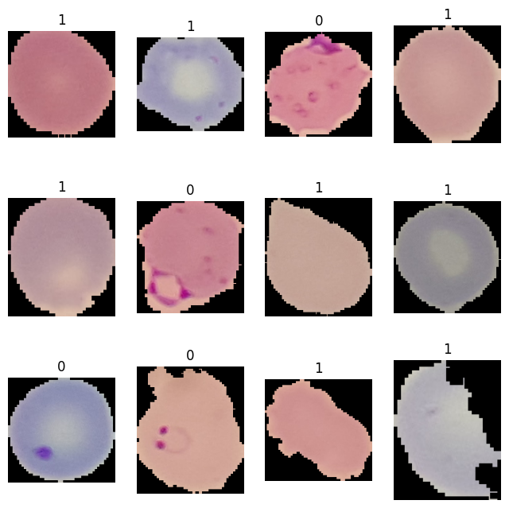
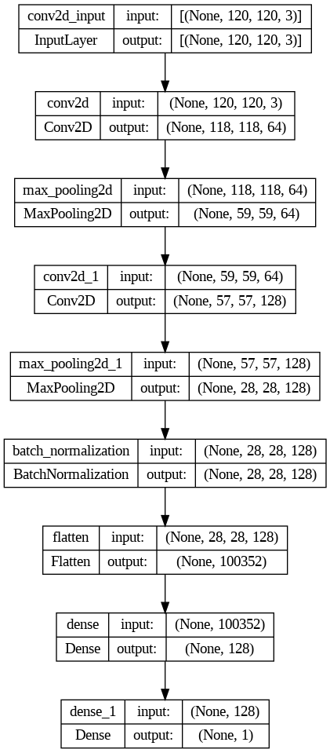
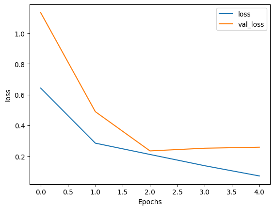
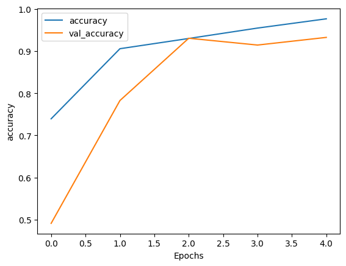

# Malaria-Classification
A Deep learning model that helps in prediction of cells diagnose with Malaria

# Malaria Classification Project

## Overview

This Jupyter Notebook project focuses on using deep convolutional neural networks (CNNs) to classify cells and predict whether they are diagnosed with malaria. Achieving an accuracy of 93%, the model demonstrates its efficacy in automated diagnosis.

## Files

- `Malaria_Detection.ipynb`: The Jupyter Notebook containing the code for the Malaria Classification project.

## Data
The dataset used for training and evaluation is the [Malaria Dataset](https://www.kaggle.com/datasets/iarunava/cell-images-for-detecting-malaria) from Kaggle, consisting of infected and uninfected cell images.

## Samples

## Architecture

## Results
The trained model achieved an accuracy of 93% on the test dataset. For detailed performance metrics and visualizations, refer to the outputs in the notebook.

### Loss

### Accurracy

